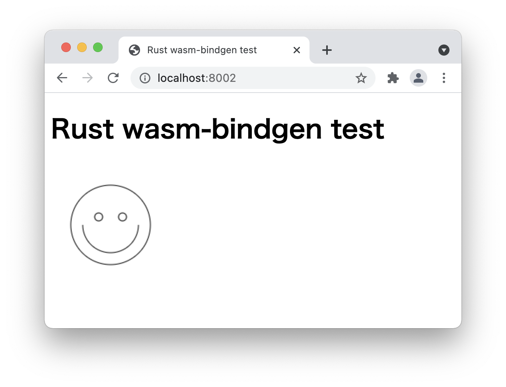

# rust-wasm-bindgen-test

<dl>
  <dt>参考サイト:</dt>
  <dd>https://developer.mozilla.org/ja/docs/WebAssembly/Rust_to_wasm</dd>
</dl>

## Prerequisite
1. rust, cargoがインストールされていること。
1. 参考サイトの通り、wasm-pack がインストールされていること。

## Building the package
```
wasm-pack build --target web
```
So, it will generate `pkg/rust_wasm_bindgen_test.js`.

## Run
```
python3 -m http.server 8002
```
And if you access `http://localhost:8002/`, you will see this:


